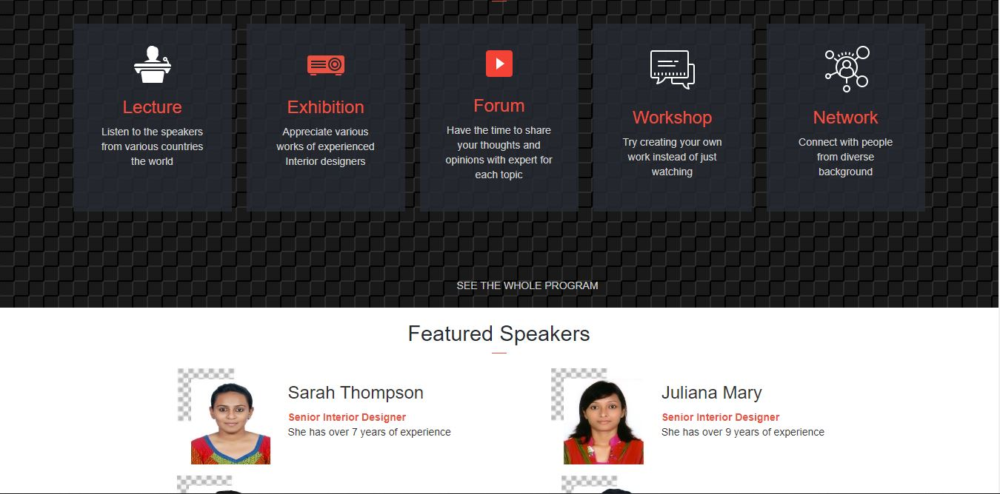

# HTML Capstone Project for Interior Design Training Event

This is a capstone project that focuses on developing a website for a Interior Design Training Event.
   
  

The aim of this project is to develop a real-world-like project based on an online website for an upcoming Interior Design Training Event. The contents are personalized and the design specifications were obtained [here](https://www.behance.net/gallery/29845175/CC-Global-Summit-2015).

## Built with
  * HTML 
  * CSS (Bootstrap)
  * Linter (Stickler)
  * W3C Validator

## Live demo
[Live Demo Link](https://edungit.github.io/edunnaty_design_agency/)

## Getting Started

To get a local copy up and running follow these simple example steps:

### Setup

Clone the project locally using  _git clone git@github.com:Edungit/html_css_capstone.git_ 

### Linters

1. run `npm install`.
2. run `npm run test` to check the HTML and CSS files.
2. run `npm run watch` to start watching for SCSS changes.

### Deployment

Install and run a live server plugin on you IDE/Text editor and run it from the root directory.

## Authors
 **Author:**
 * Name: Habeeb EDUN
 * [Github](https://github.com/edungit/)
 * [Twitter](https://twitter.com/edunaty1)
 * [LinkedIn](https://www.linkedin.com/in/edun-habeeb-635680131/)

Feel free to check the [issues page](https://github.com/edungit/edunnaty_design_agency/issues).

## Show your support
Give a :star: if you like this project!

## Acknowledgements
  * [Microverse](https://www.microverse.org/)
  * [The Odin Project](https://www.theodinproject.com/courses/html5-and-css3/lessons/embedding-images-and-video#introduction)
  * [Cindy Shin in Behance](https://www.behance.net/gallery/29845175/CC-Global-Summit-2015)

## License
 Distributed under the MIT License.
